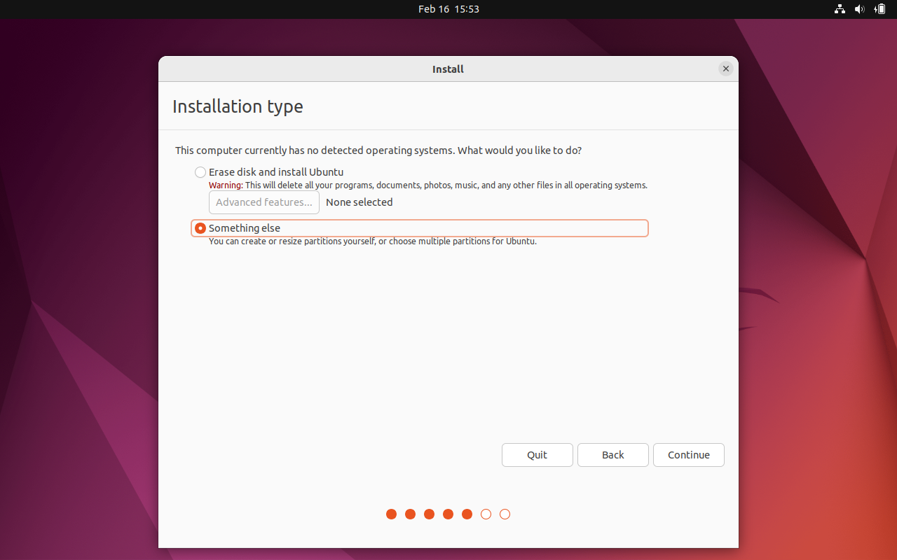

# Linux

## Praktikum 1.1

### Instalasi Ubuntu
**Persiapan:**
1. Device dengan spesifikasi minimum 4 Core CPU, 8GB RAM, 50GB Free-space, 8GB USB.
1. Mahasiswa menginstall salah satu Virtual-Machine Manager ([VirtualBox](https://www.virtualbox.org/wiki/Downloads), [VMware](https://www.vmware.com/products/workstation-player.html), [virt-manager](https://virt-manager.org/))
1. Mahasiswa mendownload ISO salah satu distribusi GNU/Linux (Disarankan [Ubuntu](https://ubuntu.com/desktop)).

**Membuat bootable device**
1. Download [Ventoy](https://www.ventoy.net/en/download.html) untuk membuat bootable device.
1. Extract archive dengan [WinRAR](https://www.rarlab.com/download.htm), [Peazip](https://peazip.github.io/index.html), atau [GNU tar](https://savannah.gnu.org/git/?group=tar).
1. Jalankan executable ventoy-GUI.
1. Ubah flashdisk menjadi ventoy device
1. Copy ISO kedalam flashdisk

**Persiapan Instalasi BareMetal**
1. Tancapkan flashdisk ke port USB sebelum menyalakan PC
1. Tekan/spam/tahan tombol BIOS
1. Ubah boot order ke USB device
1. Simpan dan keluar
1. Nyalakan kembali PC

**Persiapan Instalasi VirtualBox**
Versi yang digunakan pada dokumen ini adalah VirtualBox Versi 7
1. Buat Virtual Machine baru

1. Beri nama VM (Bebas)
1. Pilih lokasi disk vm
1. Pilih ISO Image
1. Check (Skip Unattended Installation)

1. Next
1. Deklarasi Spesifikasi minimal 2-core, 4GB RAM

    > Enable EFI jika PC mendukung UEFI
1. Deklarasi storage minimal 25GB

1. Rangkuman

1. Finish
1. Klik "Start" untuk memulai VM

**Instalasi Ubuntu**
1. Masuk kedalam GRUB menu

Silahkan pilih **Try or Install Ubuntu** untuk mencoba atau menginstall Ubuntu.\
Anda dapat memilih **Boot from next volume** untuk melanjutkan booting pada sistem operasi yang sudah terinstall.\
Pilihan **UEFI Firmware Settings** digunakan untuk masih kedalam firmware UEFI
1. Pada menu ini, kita akan memilih bahasa yang kita gunakan.

Pilih **Try Ubuntu** untuk mencoba Ubuntu sebelum menginstall. Namun pada dokumentasi ini, kita akan memilih **Install Ubuntu** untuk menginstall Ubuntu secara langsung.
1. Berikutnya kita memilih layout keyboard yang kita gunakan.

Pada umumnya, keyboard yang kita gunakan menggunakan layout English(US).
1. Berikutnya kita akan memilih jenis instalasi apakah yang akan kita lakukan.

**Normal Instalation** akan memberikan kita satu set Ubuntu dengan Web Browser (Mozilla Firefox), utilitas seperti task manager, office software (Libreoffice), games ringan, media player (Gnome Media Player).
**Minimal Installation** akan memberi kita web browser dan beberapa software utilitas.\
Saya secara personal lebih suka melakukan **Minimal Installation**, namun disini kita akan melakukan **Normal Installation**.
\
Dibagian bawah, terdapat dua opsi tambahan yang dimana saya merekomendasikan untuk mencentang keduanya untuk memastikan Ubuntu memiliki update terbaru dan juga menginstall driver untuk perangkat dan juga tambahan format media.
1. Berikutnya kita akan memilih bagaimana kita mengalokasikan storage kita. Bila dalam virtual machine, kita bisa langsung memilih opsi pertama yaitu **Erase disk and install Ubuntu**.

Namun disini kita akan memilih **Something else** untuk sedikit mendalami tentang partisi dan _filesystem_
1. Kita kemudian klik *Device* /dev/sda dan klik **New Partition Table**

1. Klik pada bagian **free space** kemudian tekan tombol "+"

1. Kita kemudian membuat partisi dengan jenis EFI System Partition (ESP) sebesar 512MB

1. Kemudian klik lagi di "free space" bagian bawah dan buat partisi baru dengan sisa penyimpanan. Pilih filesystem ext4 dengan mount point "/".

1. Ketika semua partisi sudah dibuat, hasil akhir seharusnya terlihat seperti ini. Langsung saja klik "Install Now".

1. Continue

1. Pilih zona waktu

1. Buat username dan password

1. Proses instalasi dimulai

1. Klik "Restart Now"

1. Pada tahap ini, kita bisa lepas USB kita

1. Ubuntu siap dipakai

