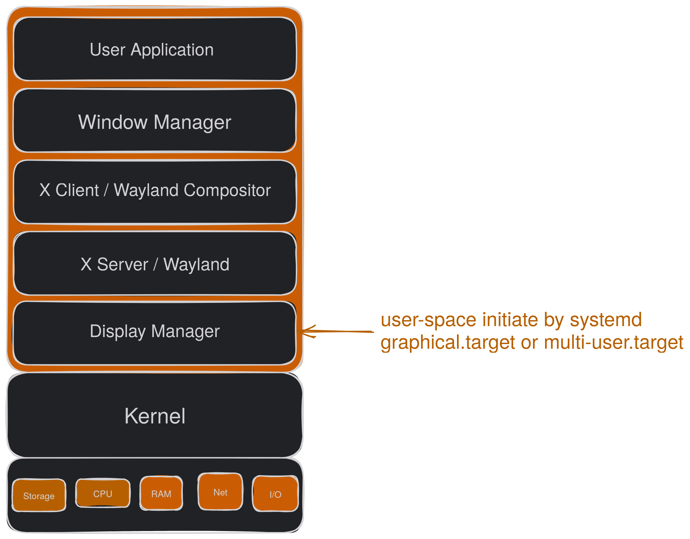
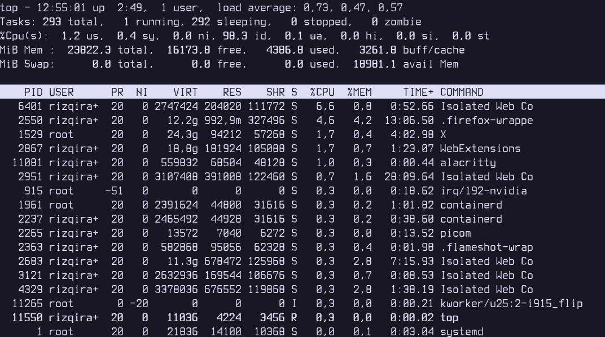
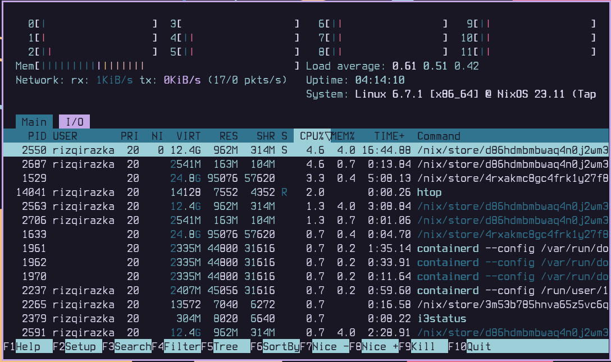
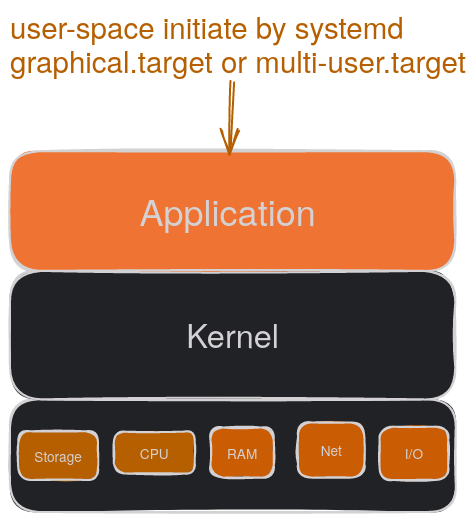

## Definisi dan Sejarah
[Linux](https://en.wikipedia.org/wiki/Linux_kernel/) awalnya adalah kernel yang ditulis oleh [Linus Torvalds](https://en.wikipedia.org/wiki/Linus_Torvalds).
Kernel ini pada awalnya ditulis oleh Linus untuk pribadi yang terinspirasi dari UNIX. Linus memulai dengan task switcher dalam bahasa intel 80386 assembly dan sebuah driver terminal pada 25 Agustus 1991.\
Sesuai dengan bahasa yang digunakan, Linux berjalan pada processor intel 386(486) AT clones.
Tidak perlu waktu lama, Linux diadaptasi oleh GNU operating system sebagai penggantu kernel mereka sendiri (GNU Hurd) yang tidak rampung.\
Linux sebagai kernel memiliki arsitektur monolitik dengan desain yang modular. Monolitik kernel adalah arsitektur sistem dimana semua sistem operasi bekerja di kernel space.

Linux juga di desain dengan sifat modular, dimana kita bisa memasukkan dan melepas loadable kernel modules. Ini memungkinkan kernel mendukung banyak fitur yang hanya tersedia pada kernel sistem operasi tidak terbuka.

## Penggambaran Peran Linux Kernel
Linux kernel berperan sebagai media komunikasi antara user space dengan hardware. Segala aktivitas yang kita lakukan didepan layar akan dilempar ke kernel menggunakan system call sebagai request yang kemudian diteruskan ke hardware dimana permintaan kita diproses.

Untuk peta dari Linux Kernel bisa diakses [Linux Kernel Map](https://makelinux.github.io/kernel/map/)

## User Space Distribusi GNU/Linux
Pada bagian _userspace_, terdapat banyak komponen yang menyusun sebuah distribusi GNU/Linux. Komponen ini berupa program-program yang memungkinkan kita berinteraksi dengan kernel menggunakan kernel syscall. Dibawah ini merupakan versi sederhana dari tech stack yang digunakan untuk distribusi GNU/Linux dengan GUI.

Pada bagian diatas kernel merupakan _userspace_ yang dimana processnya diatur oleh init system (pada kasus ini adalah systemd).\
Semua proses yang berjalan diatur oleh systemd agar tidak bertabrakan satu sama lain saat mengakses sumber daya perangkat keras yang ada.\
Kita bisa melihat proses tersebut menggunakan perintah bawaan yaitu "top".\
Buka terminal kemudian jalankan perintah "top". Maka akan muncul tampilan seperti berikut.

Kita dapat melihat informasi seperti Process ID(PID), User, dan presentasi penggunaan resource berdasarkan proses yang berjalan. Semua yang tampil pada perintah "top" adalah proses yang berjalan pada _userspace_.\
Mungkin kita ingin tampilan yang lebih memanjakan mata. Ada beberapa pilihan diantaranya adalah htop, btop, ctop.\
htop:

Bila sebuah distribusi GNU/Linux tidak terinstall dengan GUI, maka stacknya akan seperti dibawah ini:
\
Beberapa contoh program userspace adalah ls, man, cd, dll.

