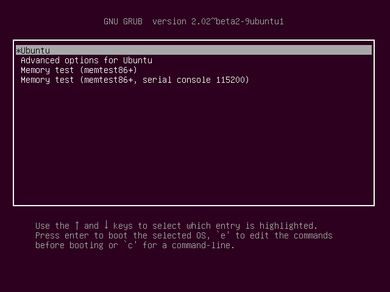
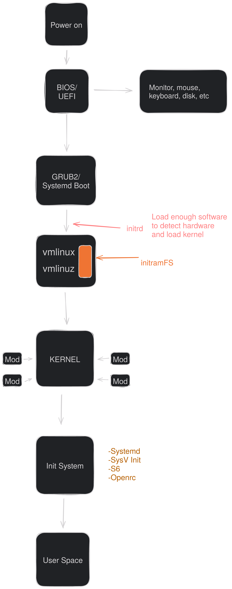

# Linux Boot Process

## BIOS/UEFI POST Test
POST (Power On Self Test). Pada tahap ini, setelah tombol **power** ditekan, sistem akan menjalankan serangkaian tes untuk memastikan semua hardware berjalan dengan baik. Proses ini meliputi tes CPU, RAM, Disk (HDD/SSD), GPU, dsb. Sebagian vendor motherboard juga melakukan pengecekan terhadap kehadiran mouse dan/atau keyboard untuk POST test.\
Untuk motherboard yang menggunakan BIOS (Basic Input Output System) akan mencari disk yang memiliki file bootable pada bagian awal sektor untuk memulai sistem operasi.\
Pada sistem UEFI (Unified Extensible Firmware Interface), firmware akan mencari partisi EFI yang menggunakan filesystem FAT-32. Dalam partisi tersebut, firmware akan mencari file sistem operasi dengan format .efi yang mengarah pada kernel sistem operasi tersebut dan menyerahkan proses kepada kernel.

## GRUB2 & systemd-boot
Pada sistem operasi modern, BIOS/UEFI tidak akan memuat kernel sistem operasi secara mandiri. Tugas ini kini diserahkan sepenuhnya ke bootloader pihak ketiga yang memiliki kompatibilitas dengan BIOS/UEFI.\
**GRand Unified Bootloader 2** yang sekarang menjadi bootloader utama untuk mayoritas distribusi GNU/Linux. GRUB2 adalah program yang membuat komputer cukup pintar untuk mencari kernel sistem operasi dan memasukkannya kedalam memori.\
Pada BIOS, GRUB2 akan di install pada Master Boot Record (MBR) pada sektor 512-byte awal disamping tabel partisi pada HDD/SSD.
GRUB2 mendukung sistem baik dengan Legacy BIOS maupun UEFI.\
**Systemd boot** adalah bootloader alternatif dari GRUB. systemd-boot dikhususkan untuk hardware dan sistem operasi berbasis UEFI. Cara kerjanya hampir sama dengan GRUB. Namun daripada menggunakan MBR, systemd-boot menggunakan GPT agar bisa digunakan.\

**GRUB2**:

**systemd-boot**:

Dengan bootloader ini, kita dapat memilih kernel manakah yang akan kita muat kedalam memori.

## Kernel
Kernel disimpan dalam format terkompresi dan dapat mengekstrak sendiri untuk menghemat tempat. Kernel berada pada direktori /boot disamping RAM disk image, dan peta dari HDD/SSD.\
Setelah kernel terpilih dimuat kedalam memori dan memulai eksekusi, kernel harus mengekstrak dirinya sendiri dari versi yang dikompresi sebelum bisa melakukan pekerjaan apapun. Setelah kernel mengekstrak dirinya sendiri, kernel memuat [systemd](https://en.wikipedia.org/wiki/Systemd) yang merupakan penggandi untuk program init lama yaitu [SysV init](https://en.wikipedia.org/wiki/Init#SysV-style) yang kemudian mengambil alih kendali.

Ini adalah akhir dari process boot. Pada titik ini, kernel Linux dan systemd telah berjalan, namun belum dapat melakukan pekerjaan prduktif untuk pengguna karena tidak ada yang berjalan selainnya.

## systemd
systemd adalah induk dari segala proses dan bertanggung jawab untuk membawa sistem Linux ke tahap dimana pekerjaan dapat dilakukan. systemd memiliki kegunanaan yang lebih luas daripada program init lainnya.
Systemd dapat memanajemen banyak aspek dari sistem Linux yang berjalan, termasuk memuat filesystem, memulai dan memanajemen services yang diperlukan oleh Linux.

Pertama, systemd akan melakukan "mounting" filesystem yang terdefinisikan di /etc/fstab, ini termasuk partisi/file swap. Pada tahap ini, systemd dapat mengakses file konfigurasi yang berada pada **/etc**, termasuk miliknya sendiri. Systemd menggunakan file konfigurasi yang terletak di **/etc/systemd/system/default.target**.
Setelah ini, systemd lah yang bertugas untuk memulai dan memanajemen services seperti multi-user, GUI, display-manager, dll.

## Diagram simplifikasi

