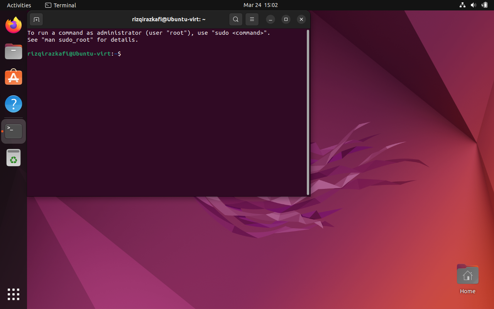
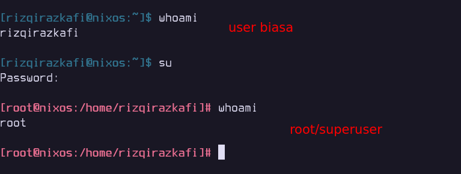

# Dasar Penggunaan Terminal GNU/Linux
Pada dokumen ini, akan diberikan dasar-dasar penggunaan terminal.
Pembelajaran Terminal dilakukan karena mengetikkan perintah lebih cepat
daripada mengakses menggunakan GUI. Mayoritas server juga hanya menggunakan
shell tanpa GUI untuk meringankan beban kerja server. Dengan mempelajari
Terminal/Shell, kita juga bisa merangkai perintah yang dibuat untuk menjalankan
rangkaian tugas sebagai otomasi.

## Definisi
[Terminal Emulator](https://en.wikipedia.org/wiki/Terminal_emulator) atau
aplikasi terminal adalah perangkat lunak komputer yang mengemulasikan Video
Terminal di arsitektur tampilan lainnya. Beberapa sinonim untuk penyebutan
terminal antara lain adalah
[shell](https://en.wikipedia.org/wiki/Command-line_interface) atau [text
terminal](https://en.wikipedia.org/wiki/Text_terminal), penyebutan terminal
melingkupi semua remote terminal, termasuk antarmuka grafis. Sebuah terminal 
emulator dalam GUI sering disebut dengan __terminal window__. Ialah sebuah 
jendela yang memberikan kita akses pada text terminal dan semua aplikasinya
seperti [command-line
interfaces](https://en.wikipedia.org/wiki/Command-line_interface) (CLI).

> Intinya adalah, terminal adalah aplikasi bentuk teks yang bisa kita gunakan
> untuk menjalankan perintah yang kita inginkan.

## Membuka Terminal

Pada sistem operasi Ubuntu, kita dapat membuka terminal dengan shortcut/keybinding
__ctrl + t__. Ini juga berlaku di beberapa Desktop Environment lainnya seperti 
KDE dan XFCE.



Segala hal yang kita lakukan dalam terminal mayoritas hanya bisa menggunakan
keyboard. Karena memang inilah intisari dari terminal, yaitu _keyboard centric_.

Ubuntu secara default menggunakan
[Bash](https://en.wikipedia.org/wiki/Bash_(Unix_shell)) sebagai shell. Tugas
dasar dari shell adalah mengeksekusi perintah yang kita jalankan. Banyak sekali
shell yang ada diluar sana seperti ZSH, FISH, DASH, nu-shell, dll. Namun untuk
kali ini, kita hanya akan menggunakan Bash sebagai shell yang paling banyak dipakai
sebagai shell bawaan distribusi GNU/Linux.

## Komponen Shell (BASH)
Gunakan <kbd>ctrl</kbd> + <kbd>t</kbd> membuka Terminal pada Ubuntu GNOME Desktop.
Dalam shell, kita bisa melihat beberapa komponen yaitu username@host-name,
kemudian diikuti oleh tanda "~" yang menandakan bahwa kita sekarang sedang berada
di HOME directory user kita. Kemudian ada tanda dollar (\$) yang menandakan bahwa
perintah yang kita jalankan merupakan sebagai user biasa dan bukan root/super user.
Sedangkan sebagai root/superuser, maka pada shell akan tertera tanda "#" seperti 
contoh dibawah ini.



> Menggunakan perintah ```whoami```, kita bisa mengecek user apakah yang kita 
miliki di sesi terminal.

### Shortcut/Keybinding Pada Terminal


|Shortcut | Fungsi|
|---------|-------|
|<kbd>ctrl + l</kbd> | Membersihkan riwayat output terminal|
<kbd>ctrl + c</kbd> | Membatalkan perintah yang sedang berjalan atau membatalkan ketikan
<kbd>ctrl + w</kbd> | Menghapus satu kata ke belakang kursor
<kbd>ctrl + u</kbd> | Menghapus semua baris sebelum kursor
<kbd>ctrl + k</kbd> | Menghapus semua baris setelah kursor
<kbd>ctrl + a</kbd> | Menuju ke awal baris
<kbd>ctrl + e</kbd> | Menuju ke akhir baris
<kbd>ctrl + r</kbd> | Menggulir ke riwayat perintah berdasarkan huruf yang diketik
<kbd>ctrl + shift + c</kbd> | Menyalin highlight dari terimanl ke clipboard
<kbd>ctrl + shift + v</kbd> | Menyalin clipboard ke terminal

### Navigasi
|Perintah | Fungsi|
|---------|-------|
pwd|Dimana saya berada?|
ls|lihat isi directory|
cd|pindah directory|
cp|Copy = menggandakan berkas|
mv|Move = memindahkan berkas|
mkdir| Make directory = membuat directory baru|
rm| Remove = menghapus |

### Redirection
Redirection merupakan metode untuk mengalihkan standard output ke tujuan lain
|Perintah | Fungsi|
|---------|-------|
cat | Concatenation = penyatuan berkas dan mencetak ke keluaran standard (standard output)|
echo | Menampilkan text |

Contoh:
```bash
echo "Hallo" > test.txt 
#Menulis "Hallo" ke file test.txt
echo "Anda" >> test.txt 
#Menulis "Anda" di baris baru ke file test.txt
echo "Pagi" > test.txt 
#Menulis "Anda" ke file test.txt dengan mengapus semua isi file test.txt sebelumnya
cat test.txt
#Menampilkan isi dari test.txt
```

### Pipes
Pipe adalah salah satu bentuk ridirection, Pipe dilambangkan dengan karakter '|' tegak lurus

Contoh:
```bash
cat file.txt | grep "hallo"
```
Perintah diatas akan mengalihkan output dari perintah ```cat``` ke perintah ```grep``` yang akan mengambil setiap baris yang mengandung "hallo" kemudian mengeluarkannya di terminal.

Semua perintah diatas dapat dibaca manualnya dengan perintah ```man <<perintah>>```


```bash
man ls
#menampilkan manual untuk perintah "ls"
man grep
#menampilkan manual untuk perintah "grep"
```


