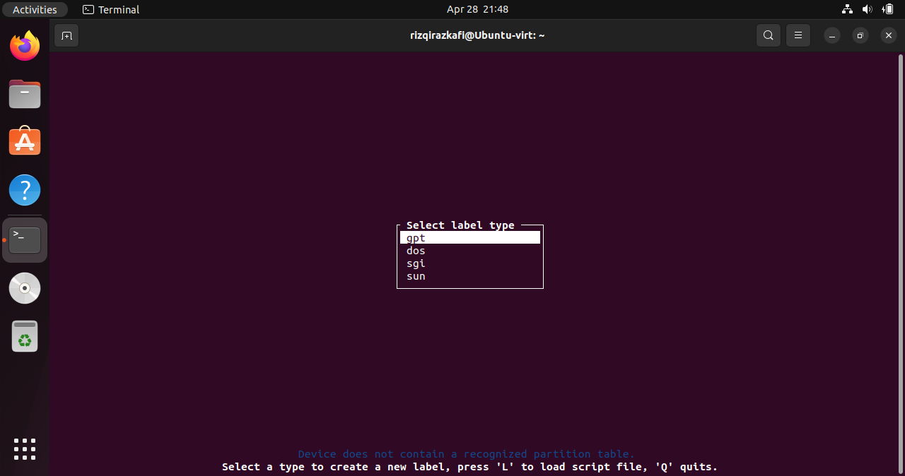
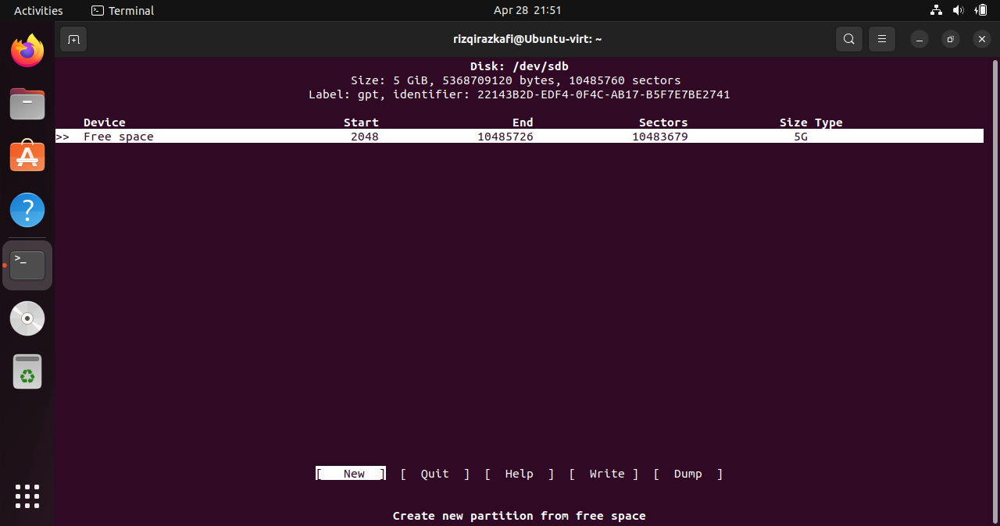
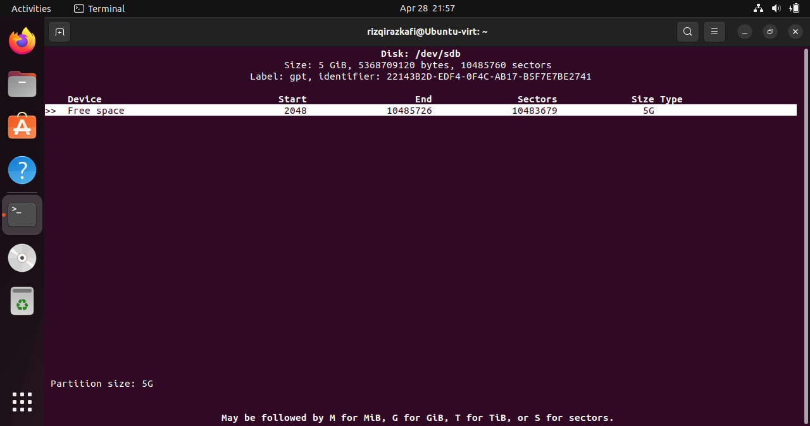
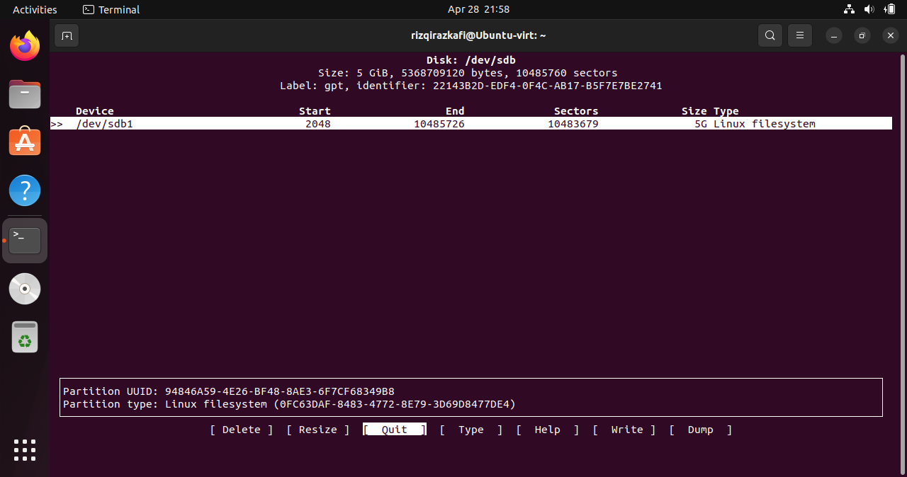
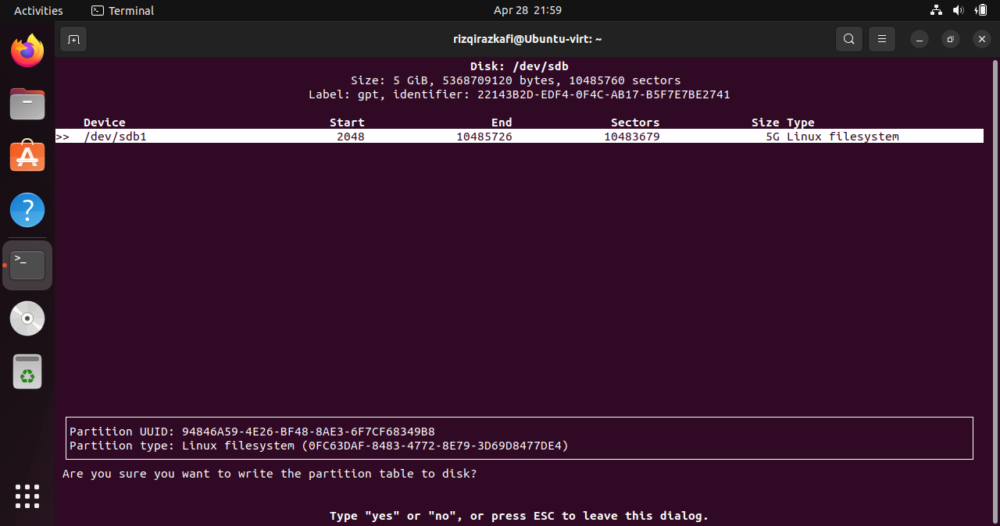

# Partition and Filesystem

## Partition
Partition/partisi merupakan metode pembagian media penyimpanan fisik sekunder menjadi bagian-bagian
individu yang terpisah dan terisolasi secara virtual. Sebagai contoh, satu
HDD atau SSD bisa dipotong menjadi beberapa bagian secara virtual untuk
memudahkan mengorganisir file atau berkas yang didalamnya.

Dalam satu media penyimpanan fisik bisa digunakan untuk satu atau lebih 
partisi. Berapa jumlah maksimum partisi dalam satu perangkat fisik ditentukan
oleh media penyimpanan itu sendiri.

## FIlesystem
Filesystem merupakan kemampuan dari sistem operasi untuk melayani aplikasi di 
komputer yang sama. Filesystem menyediakan layanan penyimpanan data yang 
memungkinkan aplikasi untuk berbagi penyimpanan. Tanpa filesystem, aplikasi 
dapat mengakses penyimpanan dengan cara yang tidak kompatibel yang mengakibatkan
kerusakan atau kehilangan data.

> Singkatnya, filesystem merupakan metode sistem operasi dalam menyimpan data
> pada media penyipaman.

Ada banyak sekali jenis filesystem yang didukung oleh Kernel Linux, yaitu:

* EXT(2,3,4)
* BTRFS
* ZFS
* NTFS
* FAT family

Bahkan mungkin hampir seluruh filesystem yang ada di dunia didukung oleh 
Kernel Linux.

## Praktikum

### Membuat Partisi Baru

Dalam praktikum ini, kita akan membuat sebuah partisi dari disk baru.
Silahkan coba membuat harddisk baru di VirtualBox sebesar 5GB.

kita bisa mengecek apakah disk terdeteksi dengan menggunakan perintah ```lsblk```

```bash
lsblk

# output:
sda      8:0    0    25G  0 disk 
├─sda1   8:1    0   487M  0 part /boot/efi
└─sda2   8:2    0  24,5G  0 part /var/snap/firefox/common/host-hunspell
                                 /
sdb      8:16   0     5G  0 disk 
sr0     11:0    1    51M  0 rom  /media/rizqirazkafi/VBox_GAs_7.0.12
```

Seperti yang terlihat, sda memiliki 2 partisi yaitu sda1 dan sda2 yang digunakan oleh sistem.
Disk yang baru saja kita tambahkan berada pada sdb dengan ukuran 5G. Apabila kita
menambahkan flag '-f', maka filesystem akan ditampilkan.

```bash
lsblk -f
#output:
NAME   FSTYPE FSVER       LABEL           UUID                                 FSAVAIL FSUSE% MOUNTPOINTS
sda                                                                                           
├─sda1 vfat   FAT32                       AE01-7892                             479,9M     1% /boot/efi
└─sda2 ext4   1.0                         19cd09a8-b517-46b5-ae4b-7ae25a0eb44d   11,9G    45% /var/snap/firefox/common/host-hunspell
                                                                                              /
sdb                                                                                           
sr0    iso966 Joliet Exte VBox_GAs_7.0.12 2023-10-12-17-41-58-38                     0   100% /media/rizqirazkafi/VBox_GAs_7.0.12

```
Kita dapat melihat bahwa sda1 menggunakan vfat(FAT32) untu menyimpan uefi 
entry, dan sda2 menggunakan ext4 untuk _root_ filesystem. Sedangkan disk 
sdb tidak memiliki filesystem bahkan UUID yang menandakan dia tidak memiliki
partition table.

Untuk konteks, setiap perangkat keras yang terhubung akan masuk dalam folder 
"/dev" yang berarti "device", ini dapat di cek menggunakan perintah ```ls```.
```bash
ls /dev
```
Dengan ini, path sesungguhnya dari setiap disk adalah "/dev/sda1" "/dev/sda2" 
"/dev/sdb". Kita akan melakukan operasi pada "/dev/sdb"

Salah satu perangkat lunak yang sering digunakan untuk melakukan operasi 
partisi ialah 'cfdisk'.

Kita pertama harus membuat tabel partisi GPT untuk /dev/sdb dengan perintah
berikut:

```bash
sudo cfdisk /dev/sdb
```
maka hasilnya akan seperti ini, silahkan pilih gpt kemudian tekan <kbd>enter</kbd>




Disini kita tinggal pilih "New" dan klik <kbd>Enter</kbd> untuk mengalokasikan
keseluruhan storage dalam satu partisi.


Hasilnya akan seperti ini :



Untuk menerapkan hasil pemartisian kita, kita pilih opsi "Write". kemudian
ketik "yes" dan tekan <kbd>Enter</kbd>



Setelah itu, kita bisa "Quit" dan jalankan kembali perintah ```lsblk -f```.

```bash
└─sdb1                                                                                        
NAME   FSTYPE FSVER       LABEL           UUID                                 FSAVAIL FSUSE% MOUNTPOINTS
sda                                                                                           
├─sda1 vfat   FAT32                       AE01-7892                             479,9M     1% /boot/efi
└─sda2 ext4   1.0                         19cd09a8-b517-46b5-ae4b-7ae25a0eb44d   11,9G    45% /var/snap/firefox/common/host-hunspell
                                                                                              /
sdb                                                                                           
└─sdb1                                                                                        
sr0    iso966 Joliet Exte VBox_GAs_7.0.12 2023-10-12-17-41-58-38                     0   100% /media/rizqirazkafi/VBox_GAs_7.0.12
```

kita bisa melihat ada sdb1 dibawah sdb, ini menandakan bahwa partisi telah
dibuat. Namun partisi ini masih belum bisa kita gunakan karena belum memiliki
filesystem.

### Format and Mount Partition

Setelah di buat, partisi harus diformat dengan filesystem tertentu agar bisa
dilakukan proses baca tulis. Kali ini, kita akan menggunakan filesystem paling
umum yaitu ext4.

```bash
sudo mkfs.ext4 -L seconddisk /dev/sdb1
```

perintah tersebut akan mengalihkan kita menjadi _super user_ untuk melakukan
operasi mkfs yang berarti "make filesystem" dengan format ext4. Flag "-L" disini
untuk memberi label pada partisi yang kita buat, kemudian diikuti dengan partisi
yang ingin kita format.

> __!!WARNING__ perintah ini akan menghapus semua data yang ada di partisi tersebut.

kemudian saat kita menjalankan ```lsblk -f```, maka hasilnya akan seperti ini.

```bash
NAME   FSTYPE FSVER       LABEL           UUID                                 FSAVAIL FSUSE% MOUNTPOINTS
sdb                                                                                           
└─sdb1 ext4   1.0         seconddisk      8ed420f7-55a4-468b-8415-33c008f09e21                
```

Ini membuktikan bahwa kita telah berhasil melakukan format partition.
Selanjutnya, kita akan melakukan mounting partition. Ada 2 metode untuk 
melakukan mounting partisi yaitu temporary dan permanent.

#### Temporary
```bash
sudo mount /dev/sdb1 /mnt
```
Perintah diatas akan melakukan mounting /dev/sdb1 ke folder /mnt, namun
apabila OS di restart, maka partisi tersebut tidak akan di mounting dan
harus di mounting ulang.

```bash
sudo umount /mnt
```

Perintah diatas akan mencabut partisi apapun yang di mount ke folder /mnt

### Permanent
Untuk membuat partisi di mounting secara permanen, maka kita harus
memasukkannya ke dalam fstab atau filesystem table. Sebelum itu, kita buat
tempat dimana partisi akan di mount. Lokasi ini bebas diletakkan dimana saja,
namun saya biasanya di dalam folder $HOME saya.

```bash
mkdir seconddisk
sudo micro /etc/fstab
```

kemudian tambahkan baris ini di baris terakhir.

```fstab
/dev/sdb1   /home/rizqirazkafi/seconddisk   ext4    defaults    0   1
```

simpan dengan <kbd>ctrl + s</kbd>, kemudian keluar dengan <kbd>ctrl + q</kbd>.
Setelah itu, perubahan dapat diterapkan dengan 
```bash
sudo mount -a
```

maka segala penambahan pada file /etc/fstab akan diterapkan.

```bash
lsblk

NAME   MAJ:MIN RM   SIZE RO TYPE MOUNTPOINTS
sdb      8:16   0     5G  0 disk 
└─sdb1   8:17   0     5G  0 part /home/rizqirazkafi/seconddisk
```

Setelah ini, apabila sistem di restart, maka partisi akan tetap ada.


